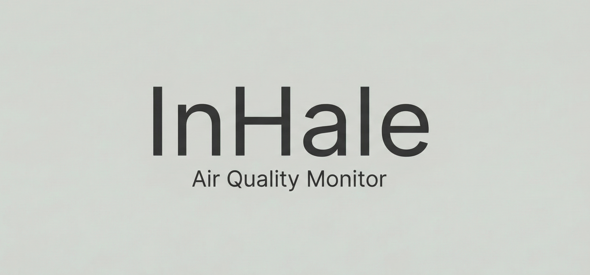

# InHale

> Your Personal Atmospheric Bodyguard




## About

**Impact Explanation.** InHale translates live particulate matter and AQI swings into visceral health signals so commuters, parents, and travelers immediately understand how much unseen pollution their lungs are processing.

**Inspiration.** The idea was forged in a wildfire season when the sky looked calm but still triggered asthma—turning invisible danger into tangible guidance became the mission.

## Key Features

- 🫁 **Living Lung Visualization** — Framer Motion animates elastic lung lobes that expand or contract with AQI volatility.
- 🚬 **Cigarette Equivalency Metric** — Converts ambient AQI into cigarette-equivalent exposure using particulate math civilians can grasp.
- 🤖 **AI Health Advice** — Google Gemini condenses exposure data into personalized guidance, recovery tips, and mitigation playbooks.
- 🔔 **Background Watchdog** — A notification engine monitors AQI deltas in the background and alerts users the moment safe thresholds are breached.
- 🌍 **Travel Mode** — Global search plus geolocation blends home context with destination scouting for smarter travel planning.

## Tech Stack

- **Frontend**: Vite, React 19, React Router, Framer Motion, CSS Modules
- **Backend**: Node.js, Express, MongoDB Atlas, Passport.js, Cookie-Session
- **AI / Data**: WAQI API, Google Gemini, geolocation + notification utilities

## Getting Started

### Prerequisites
- Node.js 20+
- npm 10+
- MongoDB Atlas cluster or reachable MongoDB instance
- WAQI + Google Cloud credentials for API access

### ⚙️ External Service Setup

**Google Cloud Console (OAuth 2.0)**
- Create a Google Cloud project (or reuse an existing one) and complete the OAuth Consent Screen for External users.
- Navigate to **APIs & Services → Credentials → Create Credentials → OAuth client ID** and choose **Web application**.
- Supply the required local URLs exactly as shown below so Google and the Express callback stay in sync.

```
Authorized JavaScript Origins:
http://localhost:5173

Authorized Redirect URIs:
http://localhost:5000/auth/google/callback
```

**WAQI API (Air Quality)**
- Request a personal WAQI token at the official portal:

```
https://aqicn.org/data-platform/token/
```

**Google Gemini AI**
- Generate a Gemini API key from Google AI Studio and keep it scoped to this project:

```
https://aistudio.google.com/app/apikey
```

### Installation
1. **Clone the repository**
   ```bash
   git clone https://github.com/your-org/InHale.git
   cd InHale
   ```
2. **Install server dependencies**
   ```bash
   cd server
   npm install
   ```
3. **Install client dependencies**
   ```bash
   cd ../client
   npm install
   ```
4. **Configure environment files**
   - Copy `server/.env.example` to `server/.env` and supply values for `MONGODB_URI`, `PORT`, `GOOGLE_CLIENT_ID`, `GOOGLE_CLIENT_SECRET`, `WAQI_API_TOKEN`, `GEMINI_API_KEY`, and `CLIENT_ORIGIN_ENV`.
   - Copy `client/.env.example` to `client/.env` and set `VITE_API_BASE_URL` and `VITE_WAQI_API_TOKEN`.

### Run (split-terminal workflow)
1. **Terminal 1 – Backend**
   ```bash
   cd server
   npm start
   # or nodemon index.js
   ```
   Server boots on `http://localhost:5000` and exposes API + OAuth callbacks.
2. **Terminal 2 – Frontend**
   ```bash
   cd client
   npm run dev
   ```
   Vite starts on `http://localhost:5173`; open that URL to explore InHale.

## Project Structure

```
InHale/
├─ client/
│  ├─ public/
│  └─ src/
│     ├─ assets/
│     ├─ components/
│     │  ├─ LocationSearch/
│     │  ├─ LungViz/
│     │  ├─ Navbar/
│     │  └─ SettingsModal/
│     ├─ context/
│     ├─ hooks/
│     ├─ pages/
│     │  ├─ Dashboard/
│     │  └─ Login/
│     ├─ services/
│     └─ styles/
└─ server/
   ├─ config/
   ├─ models/
   ├─ routes/
   └─ services/
```

## Contributing & License

- **Contributing**: Fork, branch from `main`, follow the conventional commit style, add tests or screenshots when relevant, and open a descriptive PR.
- **License**: © 2025 InHale.
